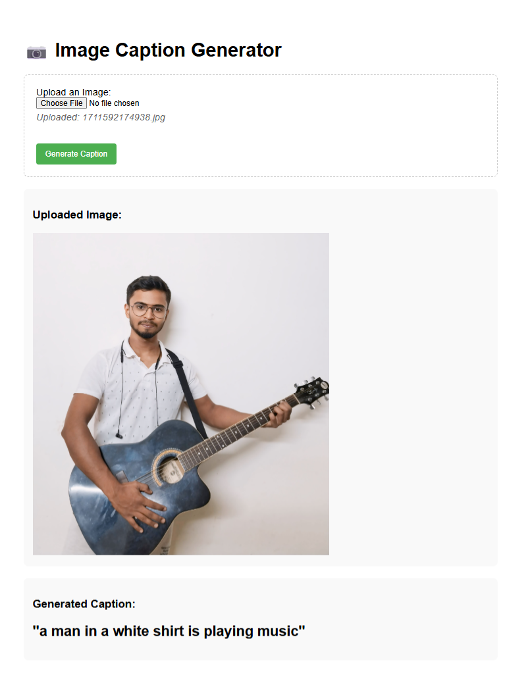
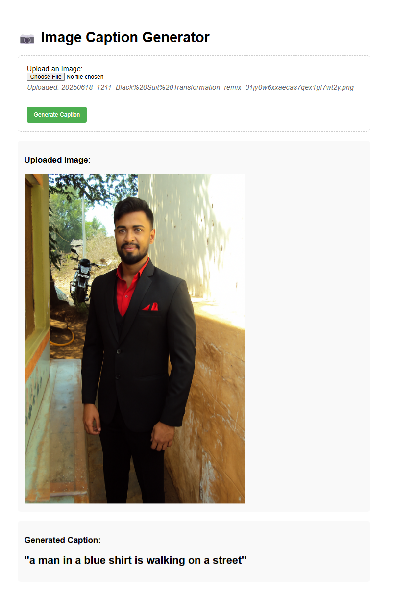
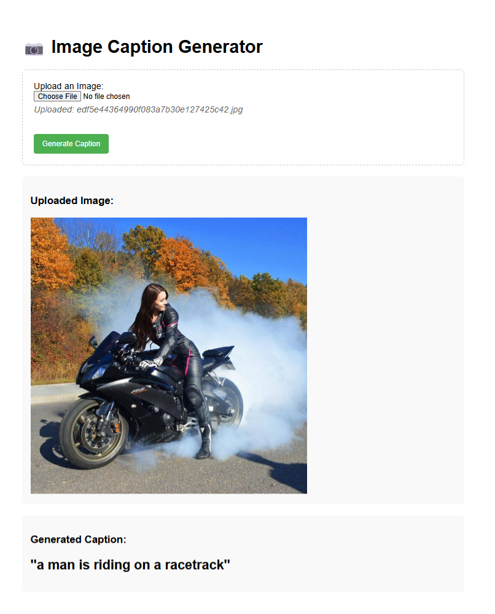
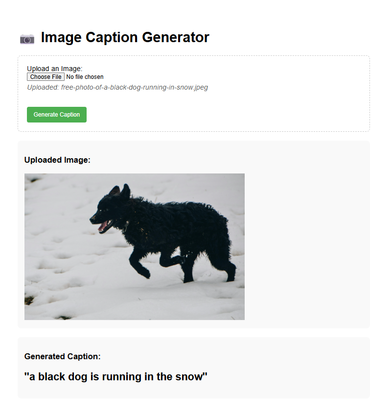
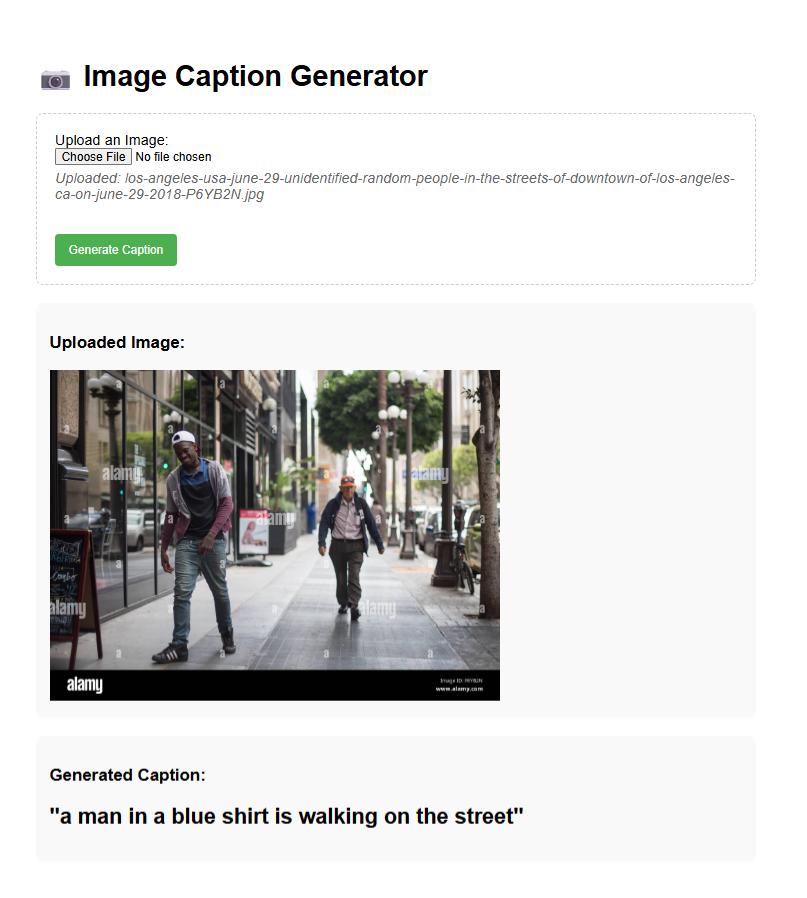
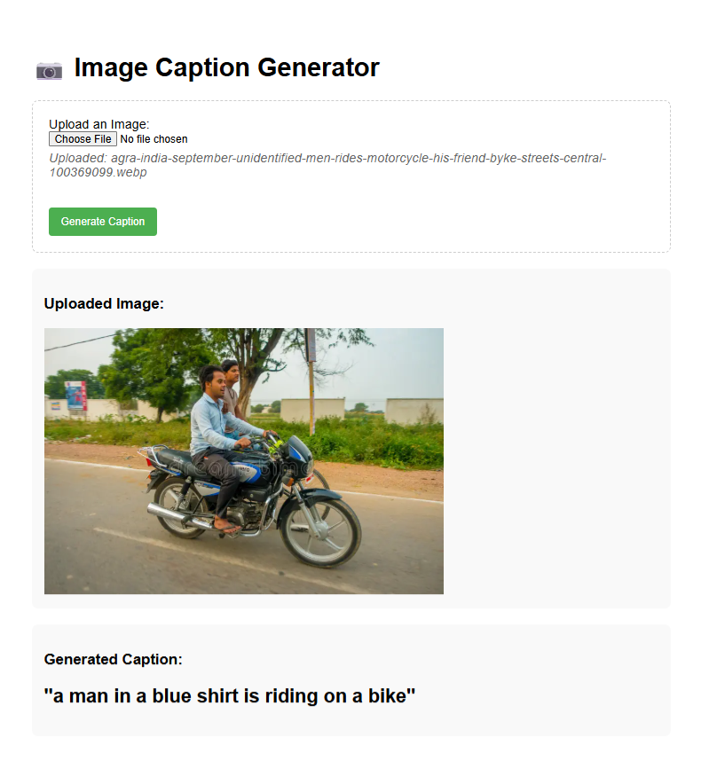
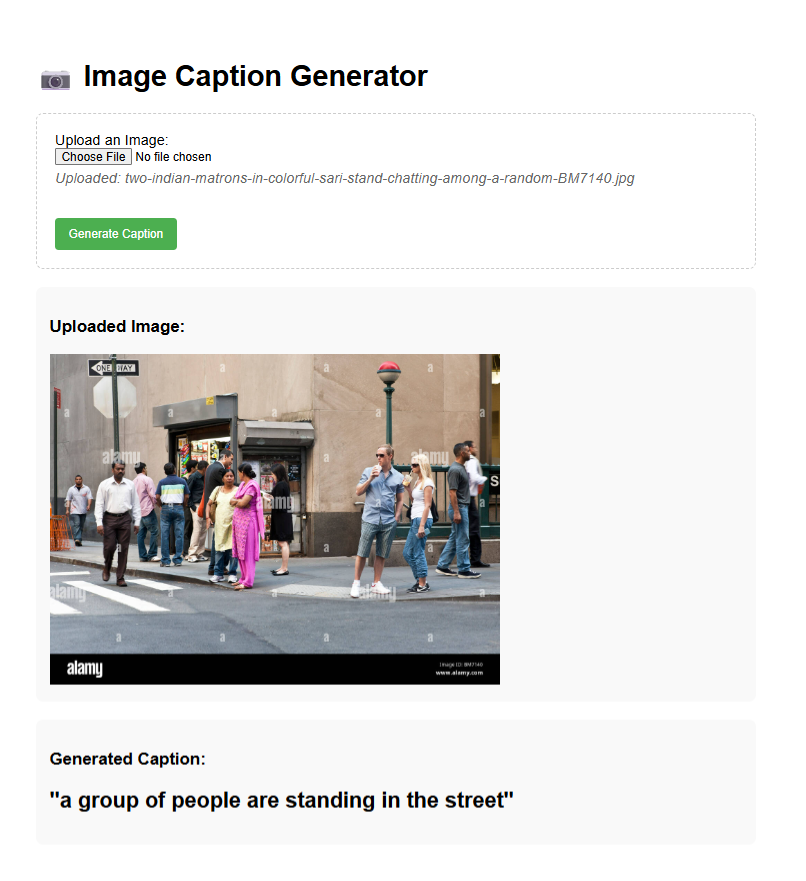

# Image Caption Generator using Deep Learning

A deep learning-based image caption generator that uses CNN (InceptionV3) for image feature extraction and LSTM for sequence generation to automatically generate descriptive captions for images.

## 📸 Project Overview

This project implements an end-to-end image captioning system that can generate natural language descriptions for images using deep learning. The model combines computer vision and natural language processing techniques to recognize image content and describe it in human-readable English.

The system was trained on the **Flickr8K dataset** containing 8,000 unique images with multiple captions per image, enabling the model to learn diverse ways of describing visual content.

## 🛠️ Technical Architecture

### Model Components
- **Image Encoder**: Pre-trained InceptionV3 CNN for feature extraction (2048-dimensional feature vectors)
- **Caption Decoder**: LSTM-based sequence model with embedding layer for text generation
- **Fusion Layer**: Combines image features and text sequences to generate captions
- **Training**: Uses teacher forcing with categorical cross-entropy loss

### Algorithms Implemented
- **Greedy Search**: Selects the highest probability word at each step
- **Beam Search**: Maintains multiple candidate sequences for improved caption quality
- **BLEU Score Evaluation**: Quantitative assessment of generated captions against reference captions

## 📂 Project Structure

```
Image_Caption_Generator/
├── Images/                     # Flickr8K dataset images
│   ├── 1000268201_693b08cb0e.jpg
│   └── ... (8,000 images)
├── image_caption_webapp/   # Flask web application
│   ├── model/
│   │   ├── image_captioning_model.keras  # Trained model
│   │   └── tokenizer.json               # Vocabulary tokenizer
│   ├── static/
│   │   └── uploads/                     # User-uploaded images
│   ├── templates/
│   │   └── index.html                   # Web interface
│   └── app.py                           # Flask application
├── captions.txt               # Image-caption pairs dataset
├── Image_Caption_Generator.ipynb  # Training notebook
└── README.md
```

## 🚀 Features

- **End-to-End Training Pipeline**: Complete workflow from data preprocessing to model evaluation
- **Multiple Decoding Strategies**: Greedy search and beam search for caption generation
- **Quantitative Evaluation**: BLEU-1 and BLEU-2 scores for assessing caption quality
- **Web Interface**: Interactive Flask application for uploading and captioning images
- **Repetition Prevention**: Advanced caption generation with n-gram blocking to prevent repetitive phrases
- **Progressive Training**: Data generators for memory-efficient training on large datasets

## 📊 Training Details

- **Dataset**: Flickr8K (8,000 images with ~5 captions each)
- **Train/Validation/Test Split**: 60%/20%/20%
- **Model Architecture**: 
  - InceptionV3 (pre-trained on ImageNet) for feature extraction
  - LSTM with 256 units for sequence generation
  - 256-unit dense layer for feature fusion
- **Optimizer**: Adam with learning rate scheduling
- **Regularization**: Early stopping based on validation loss

## 💻 Installation & Setup

```bash
# Clone the repository
git clone https://github.com/yourusername/Image_Caption_Generator.git

# Create virtual environment (recommended)
python -m venv tf-env
source tf-env/bin/activate  # On Windows: tf-env\Scripts\activate

# Install dependencies
pip install tensorflow numpy matplotlib seaborn pandas scikit-learn nltk tqdm jupyter
```

## 📥 Dataset Setup Instructions

**📌 Dataset Requirement**: Before using this project, please download the Flickr8K dataset from [https://www.kaggle.com/datasets/adityajn105/flickr8k](https://www.kaggle.com/datasets/adityajn105/flickr8k). You'll need to create a free Kaggle account to download the dataset.

After downloading the dataset:
1. Extract the ZIP file contents
2. Copy all images from the extracted folder to the `Images/` directory in this project
3. Ensure `captions.txt` is in the project root directory

The final structure should be:
```
Image_Caption_Generator/
├── Images/
│   └── [8,000 extracted images from the ZIP file]
├── captions.txt
└── [other project files]
```

## 🏃‍♂️ Usage

### 1. Training the Model
```bash
# Run the Jupyter notebook
jupyter notebook Image_Caption_Generator.ipynb
```

### 2. Using the Web Application
```bash
# Navigate to the web app directory
cd ML2/image_caption_webapp

# Run the Flask application
python app.py
```

Then open your browser and go to `http://localhost:5000` to upload images and generate captions.

## 📈 Results

The model successfully generates meaningful captions for various types of images including:
- People performing activities
- Animals in natural settings
- Urban and rural scenes
- Sports and recreational activities

Captions are evaluated using BLEU scores to measure similarity with human-generated reference captions.

## 🛠️ Challenges Addressed

- **Repetitive Captions**: Implemented n-gram repetition prevention in the decoding algorithm
- **Vocabulary Management**: Proper handling of unknown words and tokenization
- **Memory Efficiency**: Used data generators to handle large datasets
- **Model Compatibility**: Ensured proper input shapes between training and inference
- **NLTK Resource Issues**: Fixed tokenizer loading problems in deployment

## 📚 Dependencies

- Python 3.7+
- TensorFlow 2.12+
- Keras
- NumPy
- Pandas
- Matplotlib
- Seaborn
- NLTK (for BLEU score calculation)
- tqdm
- Flask (for web interface)

## 🌟 Example Results

Here are some example captions generated by the model:














